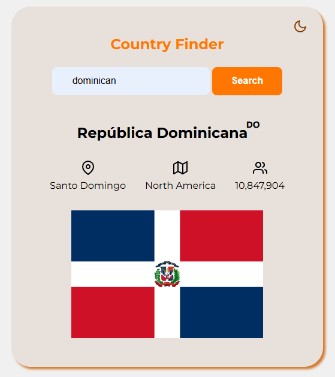

# 🌍 Country Finder

Aplicación web que permite buscar información de cualquier país en tiempo real utilizando una API pública.

## ✨ Funcionalidades

- Búsqueda de países por nombre
- Muestra:
  - Nombre oficial
  - Capital
  - Continente
  - Población
  - Bandera
- Modo oscuro / claro (toggle)
- Guarda el último país buscado en localStorage
- Manejo visual de errores (borde rojo si no se encuentra el país)

## 🛠️ Tecnologías utilizadas

- HTML5
- CSS3 (con Flexbox)
- JavaScript moderno (ES6+)
- Fetch API
- LocalStorage
- [REST Countries API](https://restcountries.com/)

## 🚀 Cómo usar

1. Clona el repositorio:
   ```bash
   git clone https://github.com/manur31/frontend.git
   ```
2. Abre el archivo `index.html` en tu navegador.

## 📷 Captura (opcional)

Agrega aquí una imagen del proyecto una vez montado:



## 📦 Estado del proyecto

✅ Proyecto completo y funcional – listo para ser mejorado con funcionalidades como traducciones, responsive design y filtros por continente.

## 📄 Licencia

Este proyecto es de uso libre con fines educativos.
